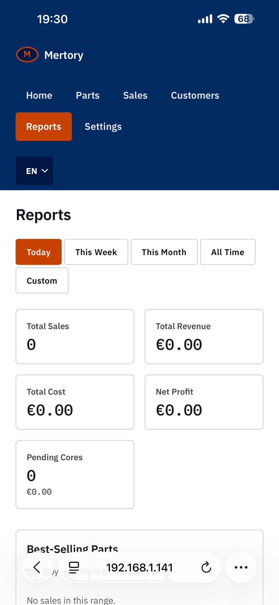
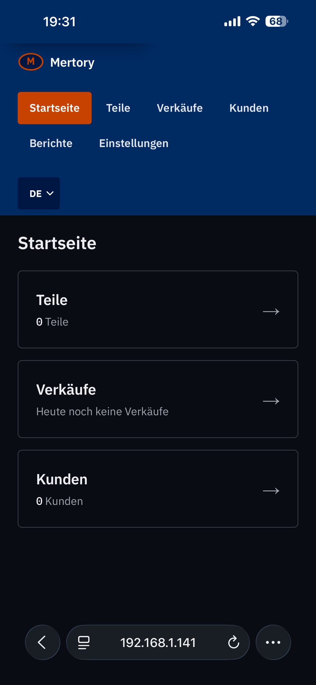
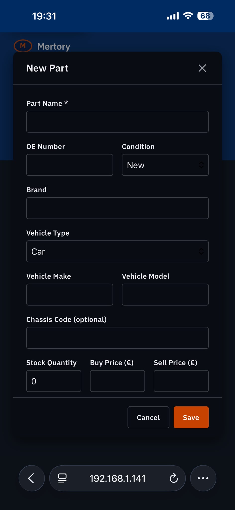
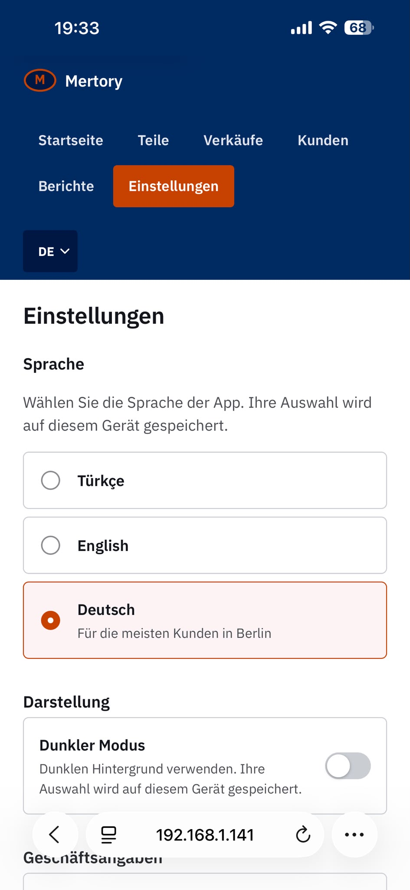

# Mertory - Inventory System

A lightweight, single-operator inventory, sales, and customer management system for a starter-motor and alternator workshop. Built to replace paper and spreadsheets with something fast enough to use mid-task at the counter.

## Overview

Mertory tracks parts stock, sales, and customer records as one linked system — a sale updates stock and ties to a customer automatically, with no manual reconciling. It supports the auto-parts industry's core-exchange model (trading in an old unit for a remanufactured one) and categorizes parts by vehicle type (car, truck, motorcycle, bus, agricultural/construction machinery). The interface is trilingual (Turkish, English, German) and ships as a desktop app via a bundled webview, backed by a local FastAPI server.

## Technologies

- **Backend:** Python, FastAPI, SQLAlchemy, SQLite
- **Frontend:** Vanilla HTML/CSS/JavaScript (no framework), custom design system
- **Desktop shell:** pywebview
- **i18n:** Custom trilingual dictionary-based system (Turkish/English/German)

## Features

- Parts inventory with stock counts, vehicle-type categorization, and condition tracking
- Core-exchange (remanufactured parts) tracking — core charges and returned/outstanding status per sale
- Sales logging with live total calculation (price × quantity + outstanding core charge)
- Customer records linked to sales history
- Reports dashboard for stock and sales overview
- CSV export (parts, sales, customers) with UTF-8 BOM for correct Turkish/German character support in Excel
- Automatic local database backups on app launch
- Light/dark theme toggle
- Trilingual UI (Turkish default, English, German) with per-device language memory

## Screenshots

| Reports | Home (dark mode) |
|---|---|
|  |  |

| Add a Part | Settings |
|---|---|
|  |  |

*Shown across different languages and themes to demonstrate the trilingual UI (Turkish/English/German) and light/dark modes.*

## Getting Started

```bash
cd backend
pip install -r requirements.txt
python app_launcher.py
```

This starts the local API server and opens the app in a desktop window. Static frontend files are served alongside the API.
